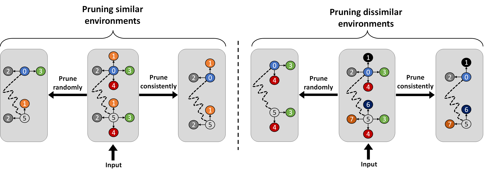

# LSP : Acceleration and Regularization of Graph Neural Networks via Locality Sensitive Pruning of Graphs



This repository contains the code of the experiments performed for our paper.

For instructions for how to run the code, please see the following.


## General instructions
Each script has a few input parameters passed via `argparse`. The parameters we use for pruning are:
* pruning_method - the pruning methodology used. `choices=["minhash_lsh_thresholding", "minhash_lsh_projection", "random"]`
* random_pruning_prob - relevant for random pruning only. indicates the amount of edges preserved from the original graph.
* num_minhash_funcs - relevant for minhash_lsh pruning methods only. indicates the number of hash functions used for the algorithm.
* sparsity - relevant for minhash_lsh pruning methods only. indicates the amount of entries used for calculating signatures.
* quantization_step - relevant for `minhash_lsh_projection` only. indicates the bin length for hashing with random projections.


## Running node classification experiments
This section of experiments divides into 2 parts:
* Running experiments on the PPI dataset
* Running experiments on all other datasets

### Running node classification  experiments on PPI
These experiments are run via the script called `tst.ogb.main_with_pruning_node_prediction_on_ppi.py`. for example, we run an experiments via executing the following command from the root directory:

```commandline
python -m tst.ogb.main_with_pruning_node_prediction_on_ppi --pruning_method random --random_pruning_prob 0.5 --device cuda:0
```

This will execute an experiment of training and testing with pruning the PPI graphs with `random` and `p = 0.5`.

### Running node classification experiments on other datasets
These experiments are run via the script called `tst.ogb.main_with_pruning_node_prediction.py`. for example, we run an experiments via executing the following command from the root directory:

```commandline
python -m tst.ogb.main_with_pruning_node_prediction_on_ppi --dataset CiteSeer --gnn sage --pruning_method random --random_pruning_prob 0.5  --device 0
```

This will execute an experiment of training and testing with pruning the CiteSeer graphs with `random` and `p = 0.5`. The experiment would be executed on The first cuda device, i.e. `cuda:0`. the graph neural network that would be used for this experiment would be `GraphSage` as described in the paper.
Possible parameters:
* dataset - `choices=['github', 'ogbg-molhiv', "Cora", "CiteSeer", "PubMed"]`
* gnn - `choices=['sage', 'gat']`


## Running graph regression experiments
Running graph regression experiments is done via the script `tst.ogb.main_pyg_with_pruning.py`. The script accepts the same arguments as the previous scripts. Additionally, for `QM9` we added another argument `target`. Please refer to the following for explanations of the targets and their indices:

https://pytorch-geometric.readthedocs.io/en/latest/modules/datasets.html#torch_geometric.datasets.QM9

An example command is:

```commandline
python -m tst.ogb.main_pyg_with_pruning --dataset QM9 --gnn mxmnet --pruning_method random --random_pruning_prob 0.2 --epochs 150 --target 9 --batch_size 128 --device 0
```

This will run an experiment using the `MXMNET` architecture with its default settings. The input graphs will be pruned preserving 20% of the edges and the target to predict will be `Enthalpy at 298.15K`. 

Another example for running an experiment on `ZINC` is:

```commandline
python -m tst.ogb.main_pyg_with_pruning --dataset zinc --gnn pna --pruning_method random --random_pruning_prob 1.0 --epochs 150
```

In this case, no target is specified since `ZINC` contains only 1 target.

## Running graph classification experiments on the synthetic data
This series of experiments is run via the script `tst.classification.tst_classify_pregenerated_dataset.py`. This script is responsible for generating the synthetic dataset, training and test. You can use this script for generating the dataset and save it for training and testing later. This feature is useful when you want to use the same dataset multiple times.

The following are the parameters for the synthetic data generator (as we describe in the paper):
* num_samples
* num classes
* min_nodes
* max_nodes
* dim_nodes
* dim_edges
* centers_nodes_std
* centers_edges_std
* node_additive_noise_std
* edge_additive_noise_std
* symmetric_flag
* noise_remove_node

### Generating a dataset for later usage
Run:

```commandline
python -m tst.classification.tst_classify_pregenerated_dataset --generate_only --dataset_path dataset/mydataset.file 
```


This will generate a dataset with the default settings and save it to the file called "dataset/mydataset.file"

### Running an experiment
You can generate a new dataset on the fly or use a pregenerated dataset. To use a pregenerated dataset, make sure the flag `generate_only` is not used. Otherwise, the script will generate a new dataset.

Example:

```
python -m tst.classification.tst_classify_pregenerated_dataset --dataset_path syn_data.file --gnn gat --epochs 200 --pruning_method minhash_lsh_projection --num_minhash_funcs 15 --device cuda:1
```